# 📄 Resume Builder AI

An intelligent, full-stack resume builder powered by AI — create, customize, and export professional resumes in minutes.

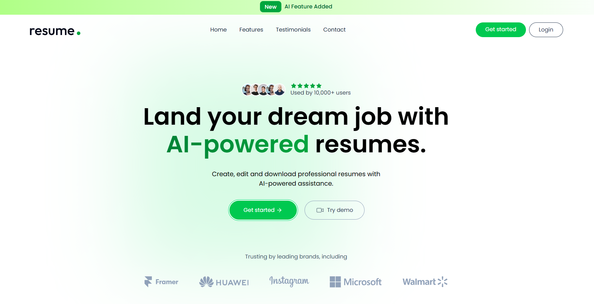

---

## ✨ Features

- 🤖 **AI-Powered Writing** — Enhance your professional summary and job descriptions with one click using OpenAI
- 📤 **PDF Resume Import** — Upload an existing PDF resume and let AI automatically extract and populate your data
- 🎨 **Multiple Templates** — Choose from Classic, Minimal, Minimal with Image, and Modern resume templates
- 🎨 **Custom Accent Colors** — Personalize your resume with a built-in color picker
- 👁️ **Live Preview** — See real-time changes as you fill in your details
- 🔐 **Authentication** — Secure user login & registration with JWT
- ☁️ **Cloud Image Upload** — Profile photo upload via ImageKit CDN
- 💾 **Auto Save** — Resumes are saved to the database automatically
- 📥 **PDF Export** — Download your finished resume as a PDF

---

## 🖼️ Screenshots

### Features Page
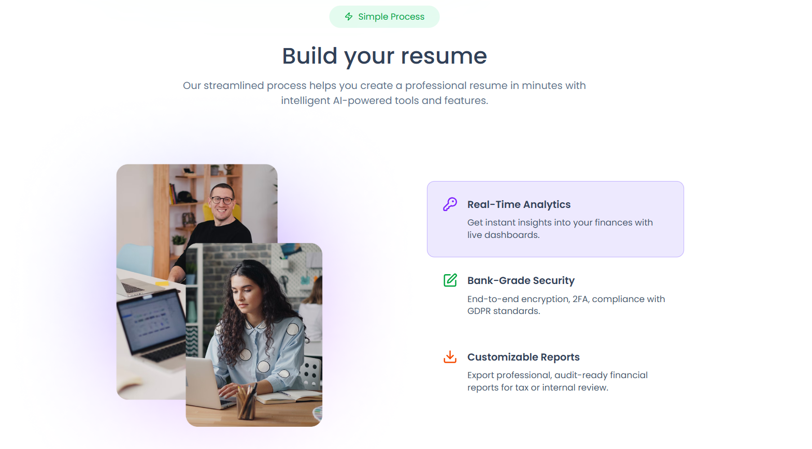

### Testimonials Page
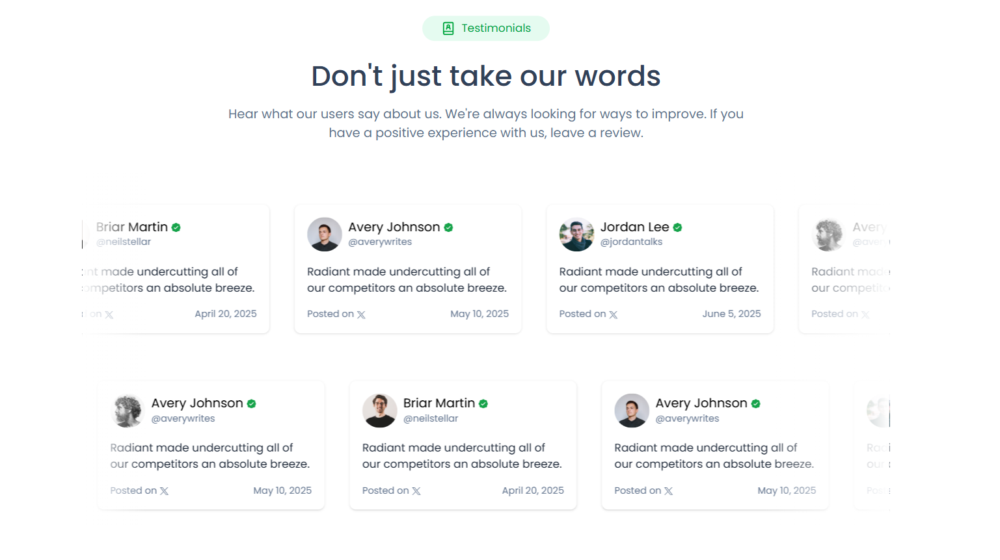

### Contact Page
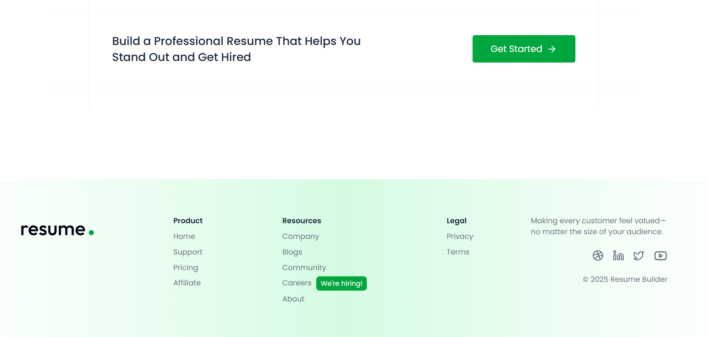

### SignUp Page
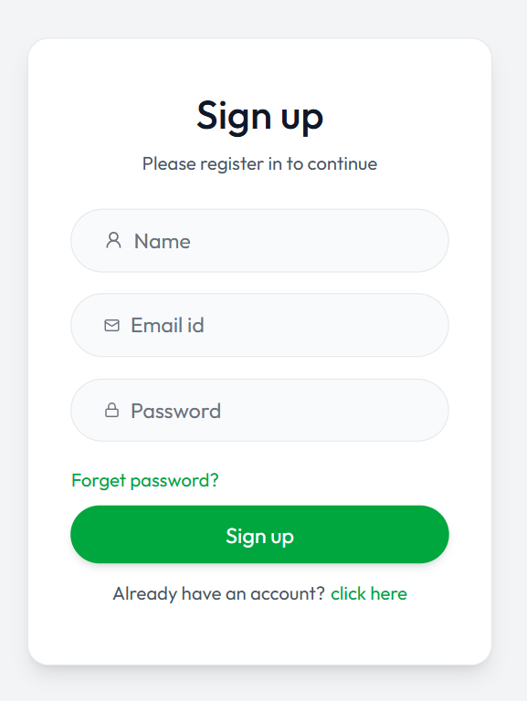

### Login Page
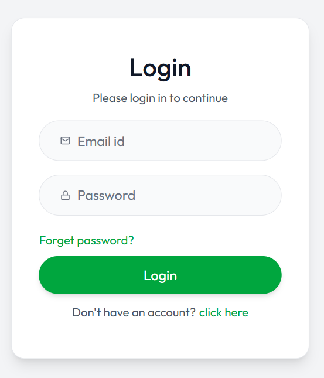

### Dashboard
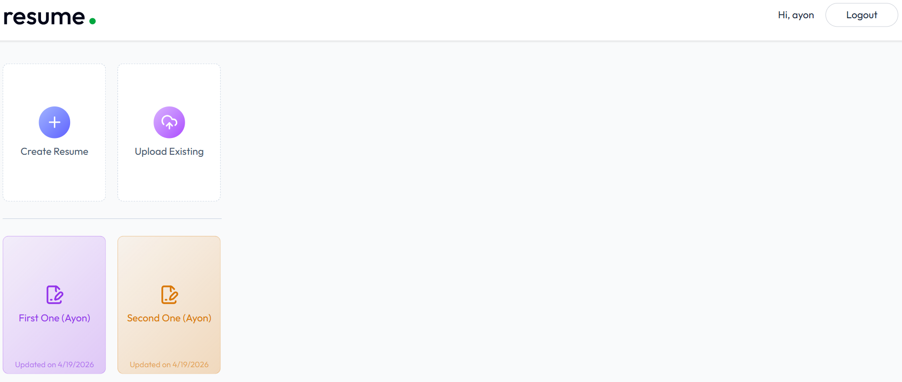

### Upload
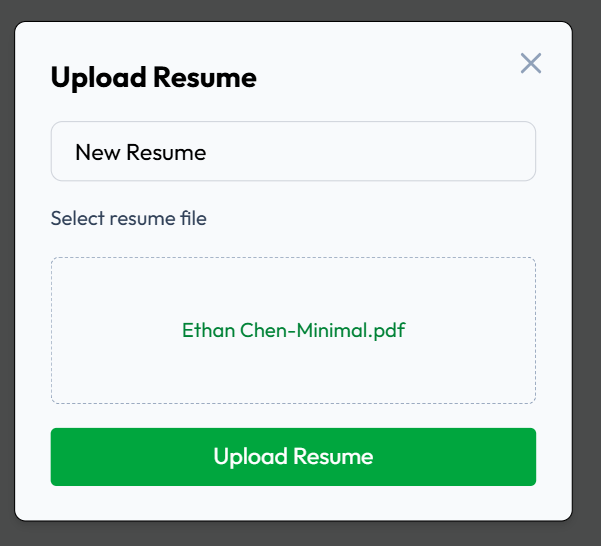

### Create
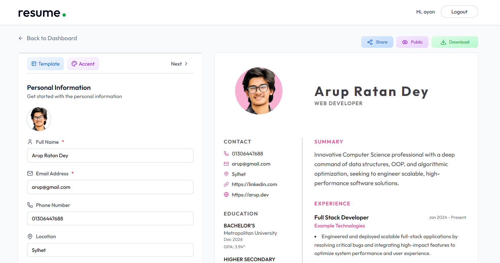

### Classic Template
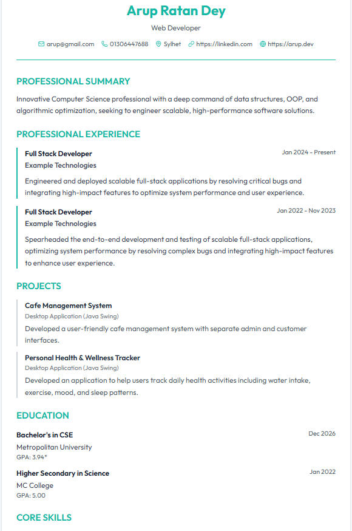

### Modern Template
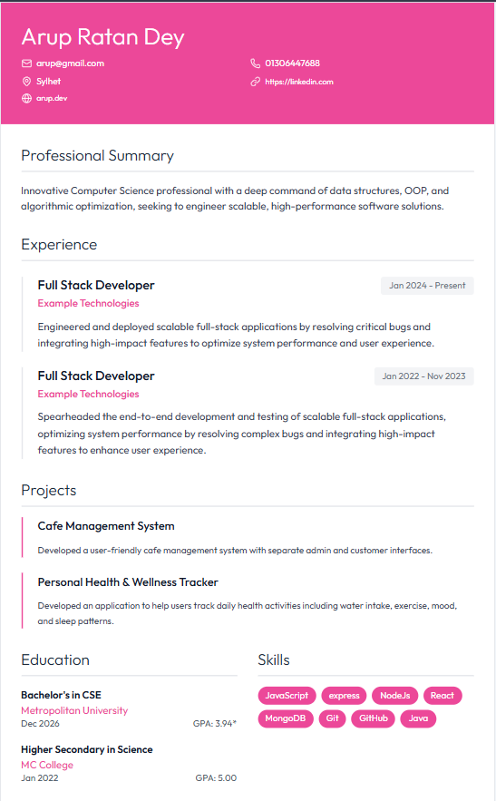

### Minimal Image Template
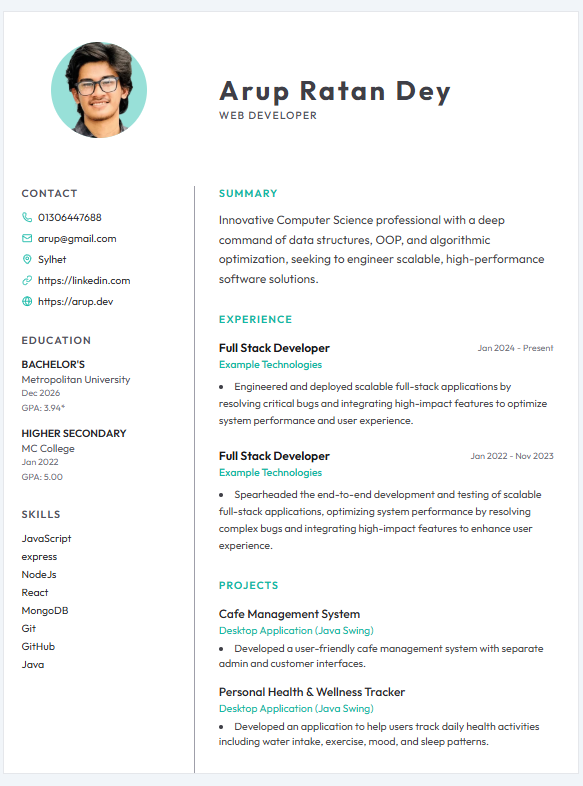

### Minimal Template


---

## 🛠️ Tech Stack

### Frontend
| Tech | Purpose |
|------|---------|
| React 19 | UI Framework |
| Vite | Build Tool |
| Tailwind CSS v4 | Styling |
| Redux Toolkit | State Management |
| React Router v7 | Client-side Routing |
| Axios | HTTP Requests |
| Lucide React | Icons |
| React Hot Toast | Notifications |

### Backend
| Tech | Purpose |
|------|---------|
| Node.js + Express 5 | Server Framework |
| MongoDB + Mongoose | Database |
| OpenAI SDK | AI Integration |
| ImageKit | Image Storage & CDN |
| Multer | File Upload Handling |
| JWT | Authentication |
| Bcrypt | Password Hashing |
| pdf2json | PDF Text Extraction |

---

## 📁 Project Structure

```
resume-builder-ai/
├── client/                     # React Frontend
│   ├── public/
│   └── src/
│       ├── app/                # Redux store & slices
│       ├── assets/             # Static assets & template previews
│       ├── components/         # Reusable UI components
│       │   ├── home/           # Landing page sections
│       │   └── templates/      # Resume template components
│       ├── configs/            # API base URL config
│       └── pages/              # Route-level pages
│           ├── Home.jsx
│           ├── Login.jsx
│           ├── Dashboard.jsx
│           ├── ResumeBuilder.jsx
│           └── Preview.jsx
│
└── server/                     # Express Backend
    ├── configs/                # DB, AI, ImageKit, Multer config
    ├── controllers/            # Route logic
    │   ├── aiController.js     # AI enhance & PDF import
    │   ├── resumeController.js # CRUD for resumes
    │   └── userController.js   # Auth logic
    ├── middlewares/            # JWT auth middleware
    ├── models/                 # Mongoose schemas
    │   ├── User.js
    │   └── Resume.js
    ├── routes/                 # API route definitions
    └── server.js               # App entry point
```

---

## 🚀 Getting Started

### Prerequisites

- Node.js v18+
- MongoDB Atlas account (or local MongoDB)
- OpenAI API Key
- ImageKit account

### 1. Clone the Repository

```bash
git clone https://github.com/your-username/resume-builder-ai.git
cd resume-builder-ai
```

### 2. Setup the Server

```bash
cd server
npm install
```

Create a `.env` file inside the `server/` directory:

```env
PORT=3000
MONGODB_URI=your_mongodb_connection_string

JWT_SECRET=your_jwt_secret_key

OPENAI_API_KEY=your_openai_api_key
OPENAI_BASE_URL=https://api.openai.com/v1
OPENAI_MODEL=gpt-4o-mini

IMAGEKIT_PUBLIC_KEY=your_imagekit_public_key
IMAGEKIT_PRIVATE_KEY=your_imagekit_private_key
IMAGEKIT_URL_ENDPOINT=your_imagekit_url_endpoint
```

Start the server:

```bash
# Development (with hot reload)
npm run server

# Production
npm start
```

### 3. Setup the Client

```bash
cd ../client
npm install
```

Create a `.env` file inside the `client/` directory:

```env
VITE_API_URL=http://localhost:3000
```

Start the frontend:

```bash
npm run dev
```

The app will be running at **http://localhost:5173**

---

## 🔌 API Endpoints

### Auth Routes — `/api/users`
| Method | Endpoint | Description |
|--------|----------|-------------|
| POST | `/register` | Register a new user |
| POST | `/login` | Login and get JWT token |

### Resume Routes — `/api/resumes`
| Method | Endpoint | Description |
|--------|----------|-------------|
| GET | `/` | Get all resumes for logged-in user |
| POST | `/` | Create a new resume |
| GET | `/:id` | Get a single resume |
| PUT | `/:id` | Update a resume |
| DELETE | `/:id` | Delete a resume |

### AI Routes — `/api/ai`
| Method | Endpoint | Description |
|--------|----------|-------------|
| POST | `/enhance-pro-sum` | Enhance professional summary with AI |
| POST | `/enhance-job-desc` | Enhance job description with AI |
| POST | `/upload-resume` | Extract resume data from PDF using AI |

---

## 🎨 Resume Templates

| Template | Description |
|----------|-------------|
| **Classic** | Traditional two-column layout, clean and formal |
| **Minimal** | Clean single-column with focus on readability |
| **Minimal + Image** | Minimal layout with profile photo support |
| **Modern** | Contemporary design with bold accent colors |

---

## 🤝 Contributing

Contributions are welcome! Feel free to open issues or submit pull requests.

1. Fork the repository
2. Create your feature branch (`git checkout -b feature/your-feature`)
3. Commit your changes (`git commit -m 'Add your feature'`)
4. Push to the branch (`git push origin feature/your-feature`)
5. Open a Pull Request

---

## 📄 License

This project is licensed under the [ISC License](./LICENSE).

---

## 🙏 Acknowledgements

- [OpenAI](https://openai.com) for the AI API
- [ImageKit](https://imagekit.io) for image hosting
- [MongoDB Atlas](https://www.mongodb.com/atlas) for the database

---

<p align="center">Made with ❤️ using React & Node.js</p>